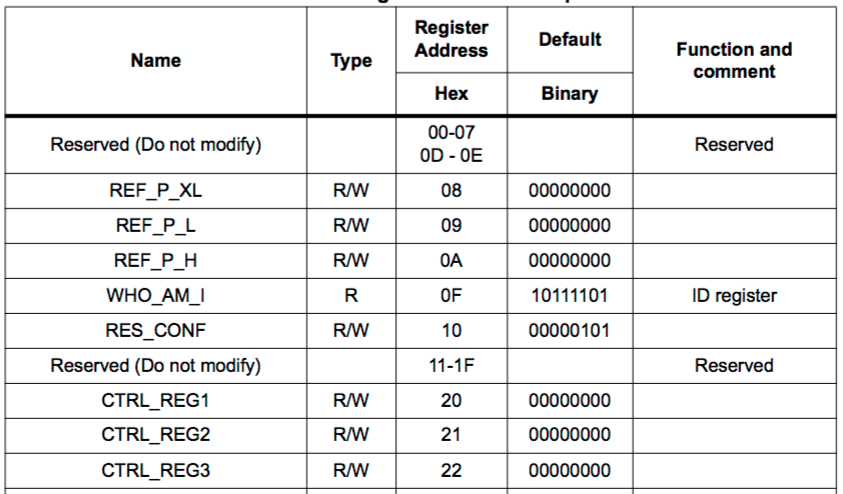
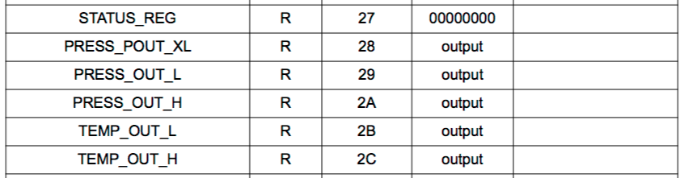

# Agenda

1. [Introduction](#/2)
1. [Astro-Pi](#/3)
1. [Reading Sensor Data](#/4)
1. [HCP IoT Services](#/5)
1. [Demo](#/6)


# Introduction
- Björn Goerke's TECHED keynote
- Goal:
  - Try SAP HCP
  - Apply Elixir in a SAP scenario
  - Create super cool demo for #sitFRA


# Astro-Pi
<!-- .slide: data-background="images/iss.jpg" -->


<!-- .slide: data-background="images/iss.jpg" -->


## Raspberry Pi Sense Hat
- Sensors
  - 3D accelerometer, 3D gyroscope and 3D magnetometer
  - Barometric pressure and temperature sensor
  - Relative humidity and temperature sensor
- Input
  - 5-button miniature joystick
- Output
  - 8×8 RGB LED matrix


# Reading Sensor Data
``` Python
from sense_hat import SenseHat

sense = SenseHat()
humidity = sense.get_humidity()
print("Humidity: %s %%rH" % humidity)
```


## Sensor Data Sheets



## Sensor Data Sheets



## Reading Sensors with Elixir 
``` Elixir
def init(:ok) do
  {:ok, pid} = I2c.start_link("i2c-1", @i2c_addr)
  I2c.write(pid, <<0x20,0x80>>)
  {:ok, pid}
end

defp trigger_measurement(pid) do
  I2c.write(pid, <<0x21,0x1>>)
end

```

## Reading Sensors with Elixir 
``` Elixir
defp read_temperature(pid) do
  <<temperature::signed-size(16)>> = I2c.write_read(pid, <<0x2c>>, 1) <>
		                     I2c.write_read(pid, <<0x2b>>, 1)
  42.5 + (temperature / 480)
    |> Float.round(2)
end
```


# HCP IoT Services
- Need to be enabled in [HCP Cockpit](https://account.hanatrial.ondemand.com/cockpit)
- [IoT Service Cockpit](https://iotcockpitiotservices-p650074trial.hanatrial.ondemand.com/com.sap.iotservices.cockpit/)


##Model AstroPi in HCP
- Model devices type
- Model messages types
- Model device 
  - Generate access token
  


## Model Messages in Elixir
``` Elixir
defmodule HCP.PressureSensorMessage do
  @derive [Poison.Encoder]

  defstruct [:timestamp, :pressure, :temperature]
end

defmodule HCP.Message do
  @derive [Poison.Encoder]

  @pressure_sensor_message_type "8a750a776851a61d2b54"
	
  defstruct [:messageType, :mode, :messages]

  def new_pressure_sensor_message(pressure, temperature, timestamp) do
    %HCP.Message{
      messageType: @pressure_sensor_message_type,
      mode: "sync",
      messages: [%HCP.PressureSensorMessage{
	           timestamp: timestamp,
	           pressure: pressure,
		   temperature: temperature}]}
  end
end
```


## Sending Data to HCP
``` Elixir
def handle_info(:send_sensor_data, sm) do
  ts = :os.system_time(:seconds)
  HCP.Message.new_pressure_sensor_message(
    Sensors.PressureSensor.get_pressure(sm.ps)
    Sensors.Pressureensor.get_temperature(sm.ps),
    ts) |>
    Poison.encode! |>
    send_to_hcp
		
    schedule_sensor_read
		
    {:noreply, sm}
end

defp send_to_hcp(message_body) do
  response = HTTPoison.post!("#{@iot_service_url}#{@device_id}",
			     message_body,
			     %{"Authorization" => "Bearer #{@oauth_token}", "Content-Type" => "application/json"})

		Logger.debug "Message: #{inspect hsm}"
		Logger.debug "Response: #{inspect response}"
end
```
# Demo